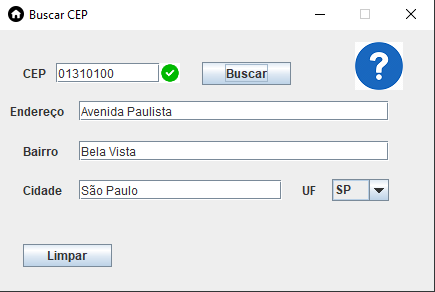

# Busca automática de CEP

Mini projeto em Java para sistema desktop (Windows, Linux, Mac) que realiza a busca automática de CEP utilizando um Web Service. Este projeto pode ser integrado a aplicações comerciais para otimizar o processo de preenchimento de cadastros de clientes, fornecedores e outros dados, aumentando a eficiência e reduzindo erros durante a coleta de informações.

## Autor
Vitor Reis

### Tecnologias usadas no projeto:
- **IDE Eclipse**
- **Java SE**
- **Window Builder**
- **Validação de dados**
- **Uso da biblioteca dom4j para trabalhar com xml**

### Bibliotecas usadas no projeto:
[Atxy2k](https://atxy2k.github.io/RestrictedTextField/)
[Dom4j](https://dom4j.github.io/)
